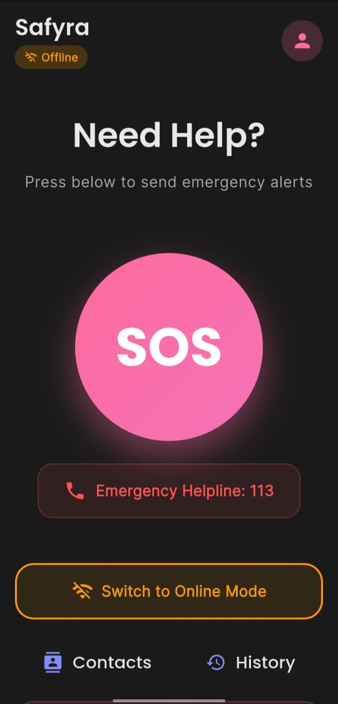
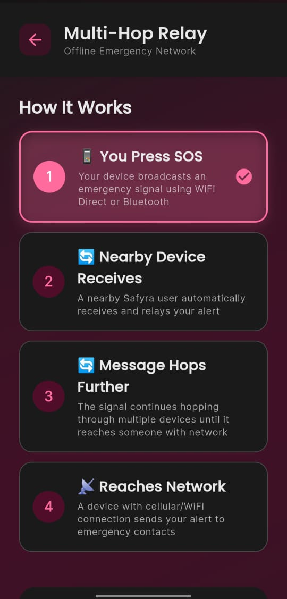
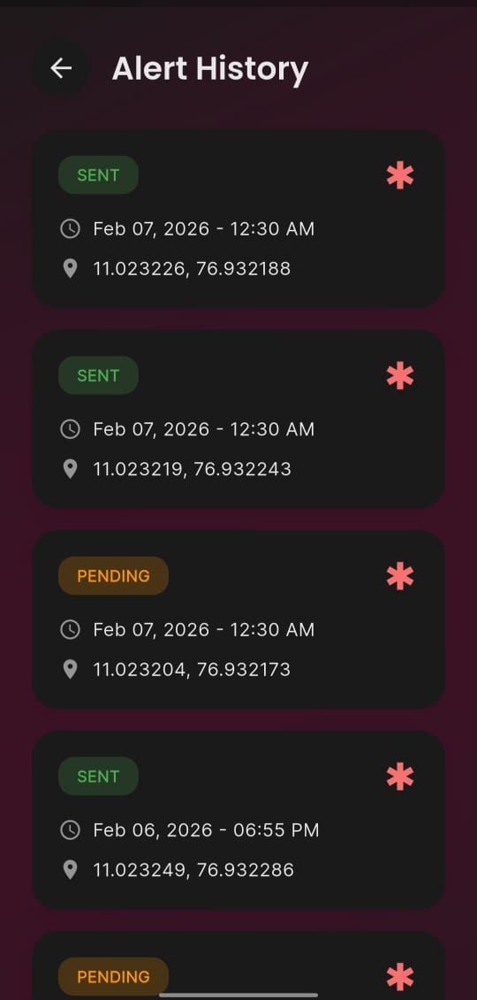
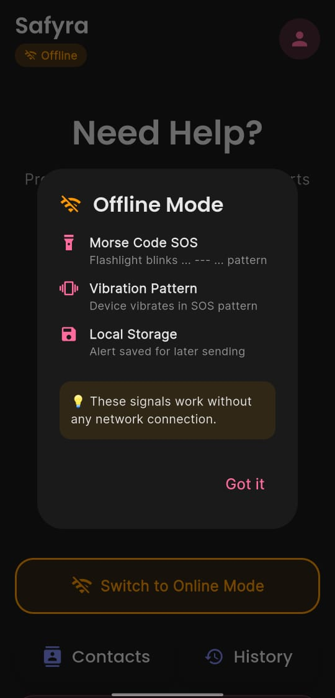
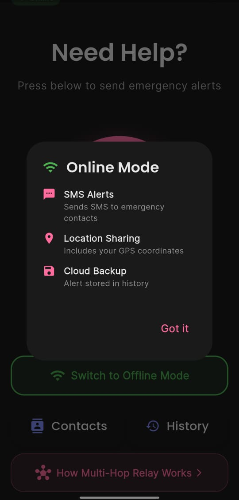
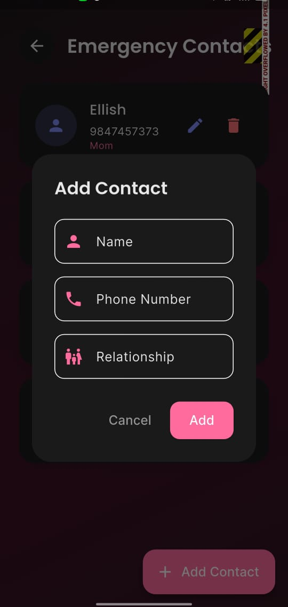

# safyra-offline-sos-app
Offline SOS emergency system using mesh networking and multi-layer fallback communication
> 🚀 HackJIT 1.0 Winner | Built in 24 hours
# Safyra – Offline SOS Emergency System

## Overview

Safyra is a mobile-based emergency response application designed to function in low or no-network environments. It enables users to send distress signals through multiple fallback communication mechanisms, ensuring reliability during critical situations.

## Key Features

* One-tap SOS emergency trigger
* Real-time location sharing (latitude & longitude)
* Automatic SMS and call alerts to emergency contacts
* Mesh networking using Bluetooth Low Energy (BLE) and WiFi Direct
* Long-range communication support via LoRa and conceptual satellite fallback
* Flash SOS, Morse code signals, and vibration-based alerts
* Lightweight architecture enabling faster distress signal transmission
* Minimal and intuitive UI for quick emergency access

## Screenshots

### Main Interface

### Multi-Hop Relay System

### Alert History

### Offline Mode Features

### Online Mode Features

### Emergency Contacts

## Tech Stack
* Flutter (Dart)
* Mobile Sensors & APIs
* Mesh Networking Concepts (BLE, WiFi Direct)
* LoRa Communication (Conceptual Integration)

## Problem Solved

Addresses safety challenges in areas with poor or no network connectivity, particularly for women and travelers, by providing reliable alternative communication channels during emergencies.

## Status

* Developed as a prototype during HackJIT 1.0 Hackathon (1st Place Winner) – Oct 2025
* Enhanced with signal optimization and battery-efficient features – Feb 2026
* Extended with conceptual long-range communication integrations (LoRa, satellite fallback)
